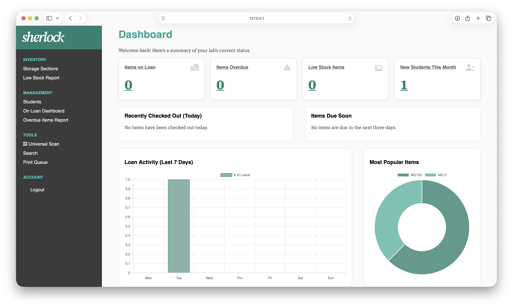
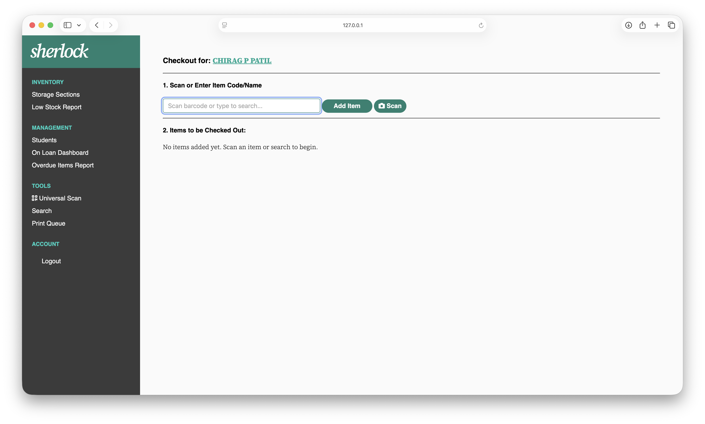
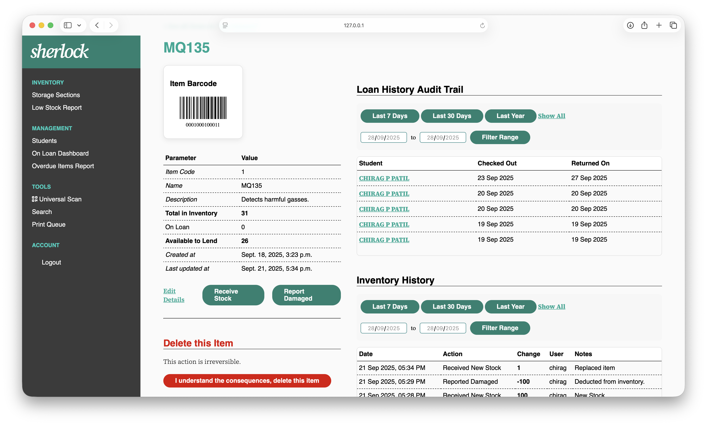
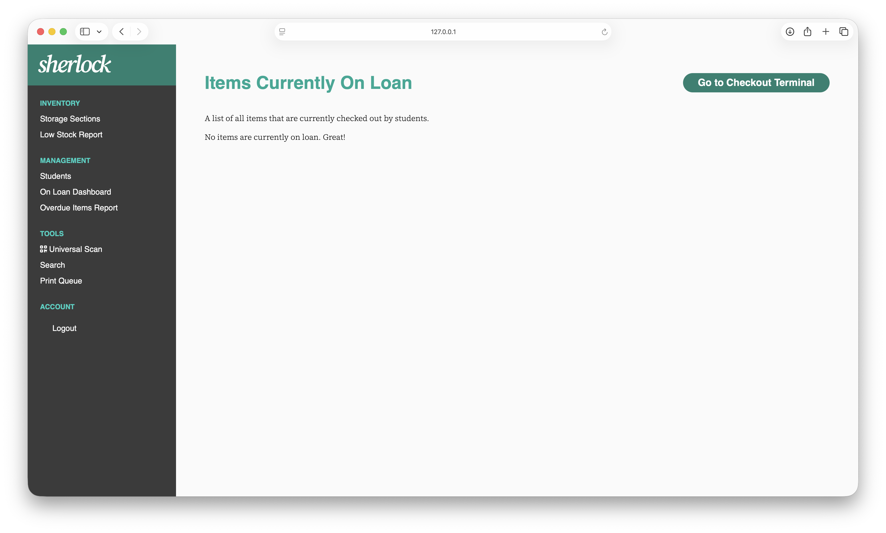

# Sherlock v2.0: Inventory & Lending Management System


**Sherlock is a comprehensive, self-hosted inventory and lending management system designed for school labs, makerspaces, and workshops.** It provides a powerful, data-driven platform to track assets, manage student loans, and gain insight into your lab's operations, all accessible from any device on your network.

This project is a complete, ground-up rewrite of the original [Sherlock v1.0](https://github.com/Atal-Lab-DPSBS/Sherlock), built on a modern and secure Python/Django backend.

---

### ✨ Features at a Glance

| Command Center Dashboard | Checkout Terminal |
| :---: | :---: |
|  |  |
| **Item Detail & Audit Trails** | **On Loan Reporting** |
|  |  |

---

## Table of Contents
- [Mission](#-mission)
- [Core Features](#-core-features)
- [Getting Started: A Step-by-Step Guide](#-getting-started-a-step-by-step-guide)
  - [Step 1: Get the Code](#step-1-get-the-code)
  - [Step 2: Install Python Dependencies](#step-2-install-python-dependencies)
  - [Step 3: Install Caddy Webserver](#step-3-install-caddy-webserver)
  - [Step 4: Run the Application](#step-4-run-the-application)
- [Technology Stack](#️-technology-stack)
- [Contributing & Development](#-contributing--development)
- [License](#️-license)

## 🌟 Mission

The goal of Sherlock v2.0 is to answer the critical questions of lab management:
*   **What** do we have and **where** is it?
*   **Who** has borrowed our equipment and **when** is it due back?
*   **How** are our resources being used over time?
*   **How** can we manage team access and security effectively?

## ✨ Core Features

### Inventory Management
*   **Hierarchical Structure:** Organize your inventory logically with **Sections**, **Spaces**, and **Items**.
*   **Complete Audit Trail:** A permanent log of every stock change (e.g., "Received New Stock," "Reported Damaged").
*   **Label Printing:** Generate and print custom barcode and QR code labels.
*   **Universal Scan:** Use any connected camera to instantly look up items, spaces, or sections from their labels.

### Advanced Lending System
*   **Student Records:** Maintain a secure database of students.
*   **Kiosk-Style Checkout Terminal:** A dedicated, fast interface for lending items.
*   **Partial Returns & Condition Tracking:** A sophisticated check-in system that allows for partial returns and tracks the condition ("OK" or "Damaged") of returned items.
*   **Due Date & Overdue Tracking:** Assign due dates to every loan and get instant visibility on overdue items.

### Administration & Security
*   **Role-Based Access Control:** A two-tier user system (**Admin** and **Member**).
*   **Live Security Dashboard:** A "Team Management" page for Admins to view real-time user activity (**Online/Offline** status), suspend/reactivate accounts, and forcibly terminate user sessions.
*   **Secure by Default:** All network traffic is encrypted via HTTPS, enabling secure camera access from any device.

## 🚀 Getting Started: A Step-by-Step Guide

This guide will walk you through the one-time setup required to run Sherlock.

### Step 1: Get the Code

Clone this repository to your local machine:
```bash
git clone https://github.com/cp099/Sherlock-Python.git
cd Sherlock-Python
```

### Step 2: Install Python Dependencies

This project uses a virtual environment to manage its packages.

1.  **Create and activate the virtual environment:**
    *   **On macOS/Linux:**
        ```bash
        python3 -m venv venv
        source venv/bin/activate
        ```
    *   **On Windows:**
        ```cmd
        python -m venv venv
        .\venv\Scripts\activate
        ```
2.  **Install the required packages:**
    ```bash
    pip install -r requirements.txt
    ```

### Step 3: Install Caddy Webserver

Caddy is a modern, secure web server that automatically handles HTTPS for us. This is **required** for the camera scanning feature to work on all devices on your network.

<details>
<summary><strong>🔵 For macOS / Linux</strong></summary>

The easiest way is to use a package manager.
*   **With Homebrew (macOS):** `brew install caddy`
*   **With `apt` (Debian/Ubuntu):** Follow the official instructions [here](https://caddyserver.com/docs/install#debian-ubuntu-raspbian).

After installation, verify it by opening a new terminal and running `caddy version`.
</details>

<details>
<summary><strong>
🪟 For Windows (Detailed Steps)
</strong></summary>

Setting up a command-line tool on Windows requires a few extra steps. Please follow these carefully.

1.  **Download Caddy:**
    *   Go to the official download page: [**caddyserver.com/download**](https://caddyserver.com/download).
    *   Select the latest version for the **Windows amd64** platform.
    *   This will download a file named something like `caddy_2.x.x_windows_amd64.exe`.

2.  **Unblock the File:**
    *   Windows automatically "blocks" executables downloaded from the internet. We must unblock it.
    *   Find the downloaded file in your Downloads folder, **right-click** it, and select **Properties**.
    *   At the bottom of the General tab, you should see a security warning. **Check the "Unblock" checkbox** and click **OK**.

3.  **Place and Rename the File:**
    *   Rename the file to `caddy.exe`.
    *   Create a new folder on your C: drive called `C:\Caddy`.
    *   Move `caddy.exe` into this `C:\Caddy` folder.

4.  **Add Caddy to the System PATH:**
    *   This is the most critical step. It allows you to run `caddy` from any terminal.
    *   Press the Windows key and search for **"Edit the system environment variables"**. Open it.
    *   In the window that appears, click the **"Environment Variables..."** button.
    *   In the bottom box, under "System variables," find and select the variable named **`Path`**.
    *   Click **"Edit..."**.
    *   Click **"New"** and type in the path to your new folder: `C:\Caddy`.
    *   Click **OK** on all three windows to save your changes.

5.  **Verify the Installation:**
    *   **Close and reopen** your terminal (Command Prompt or PowerShell).
    *   Run the command `caddy version`. If it prints a version number, you have successfully installed Caddy!

</details>

### Step 4: Run the Application

We provide simple scripts to handle both development and production modes.

#### Production Mode (Recommended)

This mode runs the secure HTTPS server, which is **required for camera scanning** to work across your network.

1.  **On macOS/Linux:**
    ```bash
    ./start_production.sh
    ```
2.  **On Windows:**
    ```batch
    start_production.bat
    ```

The script will start the Caddy and Waitress servers. You can then access Sherlock from any device at the `https://<your_ip_address>:8443` URL printed in the terminal.

> **⚠️ Browser Security Warning (First Time Only):**
> The first time you access the `https://` URL, your browser will show a security warning ("This Connection Is Not Private," etc.). This is normal and expected because the security certificate is self-signed by Caddy. **It is safe to proceed.** Click "Advanced," "Show Details," or "Visit this website" to continue. Your connection is fully encrypted.
>
> **Firewall Popup (First Time Only):**
> Your operating system's firewall (Windows Defender or macOS Firewall) will likely show a popup asking for permission for "Caddy" to accept network connections. You **must click "Allow"** for other devices to be able to connect to the server.

#### Development Mode

This mode runs a simpler HTTP server. Camera access will **only** work when accessing the site from `http://localhost:8000` on the same machine.

1.  **On macOS/Linux:**
    ```bash
    ./start_development.sh
    ```
2.  **On Windows:**
    ```batch
    start_development.bat
    ```

## 🛠️ Technology Stack
*   **Backend:** Python 3, Django
*   **Frontend:** HTML, CSS, HTMX, Chart.js, `html5-qrcode`
*   **Application Server:** Waitress
*   **Reverse Proxy (HTTPS):** Caddy

## 🤝 Contributing & Development
For a more detailed development setup, including how to create a superuser for the first time, see the [CONTRIBUTING.md](CONTRIBUTING.md) file.

## ⚖️ License

This project is licensed under the GNU General Public License v3.0. See the [LICENSE](LICENSE) file for the full license text and the [NOTICE](NOTICE) file for attribution details